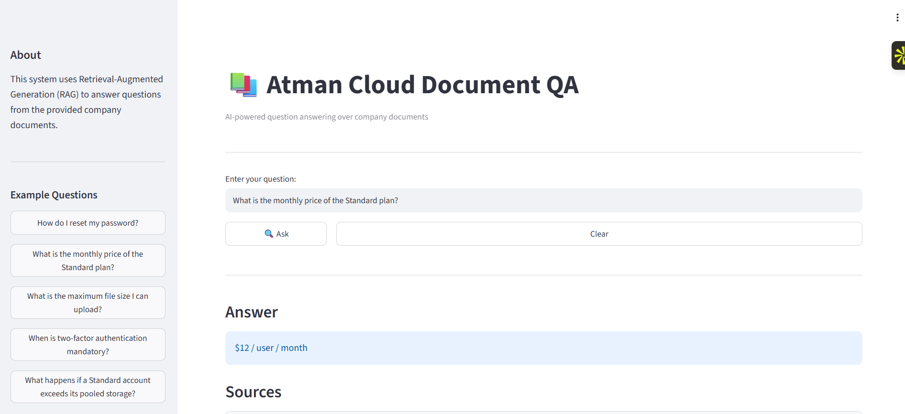
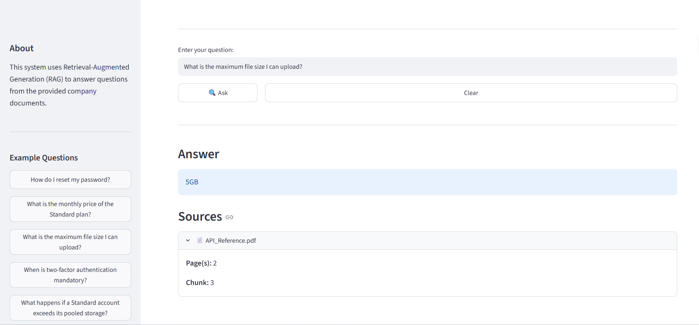
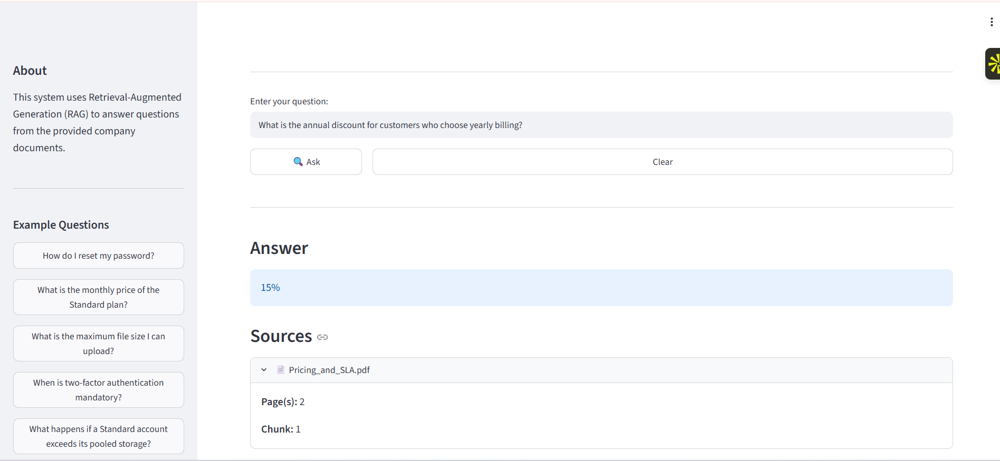
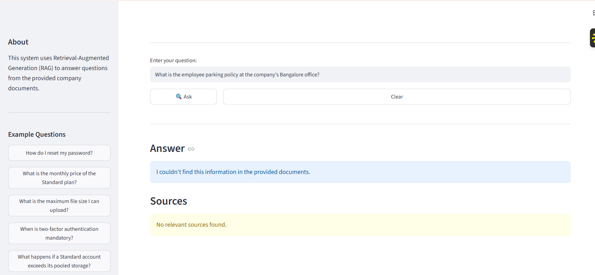

# Atman Cloud Document Q&A

A Retrieval-Augmented Generation (RAG) based document question-answering system that allows users to ask natural-language questions about the provided Atman Cloud company documents and receive concise, source-grounded answers.

The system retrieves relevant information from the documents before generating an answer and provides source attribution including the document name, page number, and chunk ID.

The application is deployed using Streamlit.

---

## Overview

The goal of this project is to build a document question-answering system that can answer questions from a collection of company documents while minimizing unsupported or hallucinated answers.

The system processes the provided PDF documents, divides them into meaningful chunks, converts the chunks into vector embeddings, stores them in a ChromaDB vector database, retrieves relevant chunks for a user query, reranks the retrieved candidates using a Cross-Encoder, and then produces an answer using either deterministic extraction or a language model.

The system returns:

- A concise answer
- Source document
- Page number(s)
- Chunk ID

If the required information cannot be found in the provided documents, the system responds:

> I couldn't find this information in the provided documents.

---

## Architecture

```text
                         ┌──────────────────────┐
                         │   Company PDF Files  │
                         └──────────┬───────────┘
                                    │
                                    ▼
                         ┌──────────────────────┐
                         │   Text Extraction    │
                         │        PyPDF         │
                         └──────────┬───────────┘
                                    │
                                    ▼
                         ┌──────────────────────┐
                         │ Document Chunking    │
                         │ Section-aware / FAQ  │
                         └──────────┬───────────┘
                                    │
                                    ▼
                         ┌──────────────────────┐
                         │ Sentence Transformer │
                         │ all-MiniLM-L6-v2     │
                         └──────────┬───────────┘
                                    │
                                    ▼
                         ┌──────────────────────┐
                         │      ChromaDB        │
                         │   Vector Database    │
                         └──────────┬───────────┘
                                    │
                                    │
                              User Question
                                    │
                                    ▼
                         ┌──────────────────────┐
                         │ Query Embedding      │
                         └──────────┬───────────┘
                                    │
                                    ▼
                         ┌──────────────────────┐
                         │ Top-k Semantic       │
                         │ Retrieval             │
                         └──────────┬───────────┘
                                    │
                                    ▼
                         ┌──────────────────────┐
                         │ Cross-Encoder        │
                         │ Reranking            │
                         └──────────┬───────────┘
                                    │
                                    ▼
                         ┌────────────────────────────┐
                         │ Answer Strategy Selection  │
                         └────────────┬───────────────┘
                                      │
                         ┌────────────┼────────────┐
                         │            │            │
                         ▼            ▼            ▼
                    FAQ Direct   Structured     FLAN-T5
                     Answer      Extraction      Generation
                         │            │            │
                         └────────────┼────────────┘
                                      │
                                      ▼
                         ┌──────────────────────┐
                         │ Answer + Sources     │
                         │ Document / Page /    │
                         │ Chunk                │
                         └──────────────────────┘
```
The system relies on semantic retrieval and reranking, so highly indirect or unusual question phrasing may sometimes retrieve less relevant context.

For unsupported questions, the system is designed to return:

`I couldn't find this information in the provided documents.`

## RAG Pipeline
### 1. Document Processing and Text Extraction

The system processes the provided company PDF documents using PyPDF.

For each page, the extracted text is stored together with metadata such as:

Document name
Page number
Extracted text

Preserving page-level metadata is important because the final answer must provide traceable source information.

The system processes the provided documents and produces a final dataset of 47 chunks.

### 2. Document Chunking

The documents are divided into smaller, meaningful chunks before generating embeddings.

Instead of applying exactly the same chunking strategy to every document, the system uses document-aware chunking.

#### General documents

For regular documents, the system first identifies logical sections and preserves those sections where possible.

For larger sections:

Chunk size: approximately 1000 characters
Overlap: 150 characters

The overlap helps prevent important information from being lost when a sentence or concept falls near a chunk boundary.

For example:
```text
Chunk 1:
... information A B C D E F G ...

Chunk 2:
... F G H I J K L M ...
```

The overlapping content helps maintain context across neighboring chunks.

#### FAQ document

The FAQ document is handled differently.

Each question-answer pair is kept together as a single chunk:
```text
Q: How do I reset my password?
A: Go to the login page and click 'Forgot password'...
```
This preserves the relationship between each question and its corresponding answer and improves retrieval for FAQ-style queries.

#### Why this strategy?

A single fixed-size strategy can unnecessarily split logical information.

For example, splitting a FAQ question and its answer into different chunks could make retrieval less effective.

The section-aware and document-specific approach keeps related information together while still limiting the size of large chunks.

### 3. Embeddings

Each document chunk is converted into a numerical vector representation using:
```text
sentence-transformers/all-MiniLM-L6-v2
```
The same embedding model is used to encode both:

Document chunks
User queries

The purpose of embeddings is to represent the semantic meaning of the text.

This allows the system to retrieve relevant information even when the wording of the user's question differs from the exact wording in the document.

For example:
```text
User query:
"What is the price of the Standard plan?"

Document:
"Standard tier costs $12 per user per month."
```
Even though the wording is different, the semantic meaning is similar and the corresponding chunk can be retrieved.

#### Why ```text all-MiniLM-L6-v2```?

The provided document collection is relatively small, so a lightweight Sentence Transformer model provides a practical balance between:

Retrieval quality
Inference speed
Local execution
No external embedding API dependency
### 4. Vector Database

The generated embeddings are stored in ChromaDB.

Each stored chunk contains both its embedding and metadata.

The metadata includes information such as:
```text
document
page(s)
chunk_id
```
This allows the system to retrieve not only the relevant text but also the source information required for attribution.

#### Why ChromaDB?

ChromaDB provides a simple interface for:

Storing embeddings
Performing similarity search
Maintaining document metadata
Retrieving relevant chunks

It is suitable for the relatively small document collection used in this assignment.

### 5. Query Processing

When a user enters a question, the question is converted into an embedding using the same Sentence Transformer model.

The query embedding is then compared with the stored document embeddings in ChromaDB.

The system retrieves the most semantically relevant candidate chunks.

The current retrieval stage uses top-k retrieval, with the initial retrieval stage returning multiple candidate chunks before reranking.

### 6. Cross-Encoder Reranking

After the initial vector search, the retrieved candidates are reranked using a Cross-Encoder.

The model used is:
```text
cross-encoder/ms-marco-MiniLM-L-6-v2
```
The Cross-Encoder receives pairs of:
```text
[User Question, Retrieved Document Chunk]
```
and assigns a relevance score to each pair.

The candidates are then sorted according to these scores.

#### Why use reranking?

Vector similarity is useful for quickly finding candidate documents, but the highest embedding similarity does not always correspond to the most relevant chunk.

The reranker evaluates the question and retrieved text together, providing a second relevance check.

The retrieval pipeline is therefore:
```text
User Question
      ↓
Embedding
      ↓
ChromaDB
      ↓
Top-k Candidate Chunks
      ↓
Cross-Encoder
      ↓
Reranked Chunks
```
This two-stage retrieval approach improves the quality of the final context supplied to the answer generation stage.

### 7. Answer Generation Strategy

The system does not send every question directly to the language model.

Instead, it uses a layered answer strategy.
```text
Retrieved Context
       ↓
Is it an FAQ answer?
       │
       ├── Yes → Direct answer extraction
       │
       └── No
             ↓
      Is it a structured fact?
             │
             ├── Yes → Deterministic extraction
             │
             └── No → FLAN-T5
```
This reduces unnecessary language-model generation for simple factual questions.

### 8. Structured Answer Extraction

For simple factual and table-based questions, deterministic extraction rules are used.

The current system handles values such as:

-File upload limits
-API rate limits
-Burst allowances
-Maximum page size
-Storage limits
-Uptime guarantees
-Annual billing discounts

For example, if the retrieved context contains:
```text
Maximum file size: 5GB
```
the system can directly extract:
```text
5GB
```
instead of asking a language model to generate the answer.

#### Why deterministic extraction?

For exact numerical and table-based information, deterministic extraction has several advantages:

-Avoids unnecessary LLM generation
-Reduces the risk of changing numerical values
-Provides consistent outputs
-Makes exact factual answers easier to verify
### 9. FAQ Direct Answer Extraction

For FAQ-style chunks, the answer is already explicitly available in the retrieved document.

For example:
```text
Q: How do I reset my password?

A: Go to the login page and click 'Forgot password'.
A reset link is emailed to your registered address and
expires after 24 hours.
```
Instead of generating a new answer, the system directly extracts the content following the answer marker.

This preserves the original information and avoids unnecessary rewriting.

### 10. LLM Answer Generation

For questions that cannot be handled by direct FAQ extraction or deterministic structured extraction, the system uses:
```text
google/flan-t5-large
```
The language model receives the retrieved document context together with the user's question.

The prompt instructs the model to:

-Use only the supplied context
-Not use outside knowledge
-Not invent information
-Return the required information concisely
-State when the answer is not available in the context

The intended behavior is:
```text
Question
   +
Retrieved Context
   ↓
FLAN-T5-large
   ↓
Grounded Answer
```
### 11. Grounding and Hallucination Handling

The system is designed to avoid generating answers that are unsupported by the provided documents.

The LLM prompt explicitly restricts the model to the retrieved context.

If the answer cannot be found in the available documents, the system returns:
```text
I couldn't find this information in the provided documents.
```
This is important for questions outside the knowledge base.

For example:
```text
Question:
What is the CEO's home address?

Answer:
I couldn't find this information in the provided documents.
```
The system does not attempt to infer or invent personal information that is not present in the documents.

### 12. Source Attribution

Every successful answer is accompanied by source information.

The application displays:

-Source document
-Page number(s)
-Chunk ID

For example:
```text
Answer:
Standard tier accounts exceeding pooled storage are charged
$0.08/GB/month for overage.

Source:
Pricing_and_SLA.pdf
Page: 2
Chunk: 2
```
Source attribution improves transparency and allows the user to trace an answer back to the original document.

## Streamlit Application

The system is deployed as a Streamlit application.

The interface provides:

-Natural-language question input
-Example questions
-Ask button
-Clear button
-Answer display
-Source document information
-Page number
-Chunk information
-Expandable source sections

The application is designed to provide a simple interface for interacting with the document knowledge base without requiring users to interact directly with the underlying RAG pipeline.

## Example Questions

The application includes example questions such as:
```text
How do I reset my password?

What is the monthly price of the Standard plan?

What is the maximum file size I can upload?

When is two-factor authentication mandatory?

What happens if a Standard account exceeds its pooled storage?
```
These examples cover different types of retrieval tasks, including FAQ, numerical, policy, and table-based questions.

## Evaluation

The system was evaluated using 20 test questions designed to cover different question types.

The evaluation set includes:

-Direct factual questions
-Table-based questions
-Numerical questions
-Policy questions
-Paraphrased questions
-Unanswerable questions

The evaluation results are stored in:
```text
rag_evaluation_results.csv
```  
## Evaluation Questions

The test set includes questions covering:

1.Password reset procedure
2.Standard plan pricing
3.Deleted file recovery period
4.Two-factor authentication requirements
5.Data retention after subscription cancellation
6.Maximum file upload size
7.Standard plan API request limit
8.New employee probationary period
9.Unanswerable personal information
10.Unanswerable personal information
11.Monthly-to-annual billing change
12.Student/nonprofit discount
13.Standard plan storage
14.Enterprise uptime guarantee
15.Standard plan storage overage
16.Enterprise burst allowance
17.Maximum page size
18.MFA requirement for Restricted Data
19.Day-60 onboarding responsibility
20.Unanswerable technical information

The evaluation includes at least two deliberately unanswerable questions to verify that the system does not fabricate information.

## Evaluation Results

The evaluation results are recorded in:
```text
rag_evaluation_results.csv
```
The evaluation file contains:

`Test question
`Generated answer
`Source document
`Page number(s)
`Chunk ID

The results include successful retrievals from documents such as:

```textFAQ_Support.pdf```
```textPricing_and_SLA.pdf```
```textProduct_Manual.pdf```
```textAPI_Reference.pdf```
```textOnboarding_Guide.pdf```
```textSecurity_Policy.pdf```

For unanswerable questions, the system correctly returns:
```text
I couldn't find this information in the provided documents.
```
and does not provide a fabricated source.

## Sample Q&A Log

The `rag_evaluation_results.csv` file contains 20 example questions along
with the generated answers and source attribution.

The evaluation set covers:

- Direct factual questions
- Table-based questions
- Numeric questions
- Policy questions
- Paraphrased questions
- Unanswerable questions

The unanswerable questions are included to verify that the system does not
hallucinate information when the answer is not available in the provided documents.

## Design Decisions and Trade-offs
### Why document-aware chunking?

Different documents have different structures.

FAQ documents naturally consist of question-answer pairs, while manuals and policy documents contain logical sections.

Therefore, a document-aware chunking strategy was preferred over applying a single blind fixed-size split to every document.

### Why 1000-character chunks?

The chunk size provides enough context for most factual and policy-related information while keeping individual retrieval units reasonably focused.

Larger sections are split into approximately 1000-character chunks with 150-character overlap.

### Why 150-character overlap?

Important information can cross a chunk boundary.

A 150-character overlap helps preserve context between neighboring chunks without creating excessive duplication.

### Why Sentence Transformer embeddings?

The embedding model provides semantic representations that allow retrieval based on meaning rather than exact keyword matching.

The selected model is lightweight and suitable for local execution on the relatively small document corpus.

### Why ChromaDB?

ChromaDB provides a straightforward way to store embeddings together with metadata and perform similarity-based retrieval.

The corpus is small enough that a lightweight vector database is sufficient.

### Why Cross-Encoder reranking?

The initial vector search is optimized for retrieving candidate chunks efficiently.

The Cross-Encoder then performs a more focused relevance assessment between the question and each candidate chunk.

This creates a two-stage retrieval pipeline:
```text
Fast candidate retrieval
        ↓
More precise reranking
```
### Why deterministic extraction?

Exact numerical and structured answers are better handled deterministically when possible.

For example:
```text
5GB
600 requests/minute
99.95%
500 GB
```
do not require free-form language generation.

Deterministic extraction reduces unnecessary model generation and helps preserve exact values.

### Why FLAN-T5-large?

Some questions require natural-language responses rather than direct extraction.

For those cases, FLAN-T5-large is used to generate a concise answer from the retrieved context.

The model is instructed to use only the supplied context to reduce unsupported generation.

### Why not use the LLM for every question?

Using an LLM for every question introduces unnecessary generation for simple factual queries.

For exact values and FAQ answers, deterministic extraction is:

-Faster
-More predictable
-Easier to verify
-Less likely to modify exact values

The LLM is therefore used primarily when natural-language generation is actually required.

## Handling Unanswerable Questions

A key requirement of the system is to avoid hallucinating information.

If the relevant information cannot be found in the provided documents, the system returns:
```text
I couldn't find this information in the provided documents.
```
Example:
```text
Question:
What is the CEO's personal phone number?

Answer:
I couldn't find this information in the provided documents.
```
This ensures that the system does not present unsupported information as factual.

## Limitations

The current system has several limitations.

### 1. Retrieval dependency

The quality of the final answer depends on the quality of the retrieved chunks.

Highly indirect or unusual question phrasing may sometimes retrieve less relevant context.

### 2. Small document corpus

The system was designed and tested on the provided company documents.

Performance on a much larger document collection may require additional retrieval optimization.

### 3. Structured extraction rules

Deterministic extraction currently supports a predefined set of factual patterns.

New types of structured questions may require additional extraction rules.

### 4. Context selection

The final answer generation uses the highest-ranked retrieved context for the current question.

Questions whose answers are distributed across multiple chunks may require multi-chunk reasoning.

### 5. Local model inference

The project uses locally loaded embedding, reranking, and generation models.

Model loading and inference can require significant memory and startup time depending on the execution environment.

## Technologies Used
-Python
-PyPDF
-Sentence Transformers
-ChromaDB
-Cross-Encoder
-Hugging Face Transformers
-FLAN-T5-large
-Streamlit
-Pandas

## AI Assistance

ChatGPT was used as a coding and documentation assistant during development,
including debugging, code organization, README preparation, and project refinement.

The RAG pipeline implementation, testing, and evaluation were reviewed and
validated during the project development process.

## Project Structure
```text
Atman-Cloud-Document-QA/
│
├── app.py
├── README.md
├── RAG_Document_QA.ipynb
├── requirements.txt
├── rag_evaluation_results.csv
│
└── data/
    ├── Product_Manual.pdf
    ├── Employee_Handbook.pdf
    ├── API_Reference.pdf
    ├── FAQ_Support.pdf
    ├── Security_Policy.pdf
    ├── Onboarding_Guide.pdf
    └── Pricing_and_SLA.pdf
```
The ChromaDB vector store is generated/used by the application as part of the retrieval pipeline.

### Installation

Clone the repository:
```text
git clone https://github.com/Goutam14226/Atman-Cloud-Document-QA.git
cd Atman-Cloud-Document-QA
```
Install the required dependencies:
```text
pip install -r requirements.txt
```
## Vector Database Setup

The application uses ChromaDB for storing document embeddings.

After installing the dependencies, open `RAG_Document_QA.ipynb` and run the
notebook cells through the ChromaDB indexing step.

The notebook:

1. Extracts text from the provided PDFs.
2. Creates document chunks.
3. Generates embeddings.
4. Creates the ChromaDB collection.
5. Stores the document embeddings and metadata.

This creates the local `chroma_db` directory required by `app.py`.

After the vector database has been created, run the Streamlit application:

```bash
streamlit run app.py

## Running the Application

Run the Streamlit application using:
```text
streamlit run app.py
```
After starting the application, open the Streamlit URL provided in the terminal.

The application will display the document Q&A interface.

### Environment Configuration

No external API keys are required for this project.

An `.env.example` file is included as a template for environment configuration.


## Requirements

The main dependencies used by the project are:
```text
chromadb
sentence-transformers
transformers
torch
streamlit
pandas
pypdf
```
All dependencies are listed in:
```text
requirements.txt
```
### Example End-to-End Flow

For a question such as:
```text
What happens if a Standard account exceeds its pooled storage?
```
the system follows this process:
```text
User Question
      ↓
Query Embedding
      ↓
ChromaDB Semantic Retrieval
      ↓
Top-k Candidate Chunks
      ↓
Cross-Encoder Reranking
      ↓
Relevant Pricing Chunk
      ↓
Structured Answer Extraction
      ↓
$0.08/GB/month overage
      ↓
Source Attribution
```
The application displays the answer together with:
```text
Document: Pricing_and_SLA.pdf
Page: 2
Chunk: 2
```
### Future Improvements

Possible improvements to the current system include:

-Hybrid keyword + semantic retrieval
-More advanced reranking
-Multi-chunk context generation
-Automated retrieval evaluation metrics
-Larger evaluation datasets
-Query rewriting for highly indirect questions
-Improved confidence-based handling of unanswerable questions
-Conversation history for multi-turn questions
### Conclusion

This project implements an end-to-end Retrieval-Augmented Generation system for question answering over company documents.

The pipeline combines:
```text
PDF Processing
      ↓
Document-Aware Chunking
      ↓
Semantic Embeddings
      ↓
ChromaDB Retrieval
      ↓
Cross-Encoder Reranking
      ↓
Deterministic Extraction / LLM Generation
      ↓
Grounded Answer
      ↓
Source Attribution
```
The system is designed to provide concise answers while maintaining traceability to the original documents and avoiding unsupported answers when the required information is not available in the knowledge base.

## Demo

The Streamlit application provides an interactive interface for
question answering over the provided company documents.

### Example 1 — Standard Plan Pricing



### Example 2 — File Upload Limit



### Example 3 — Annual Billing Discount



### Example 4 — Unanswerable Question



